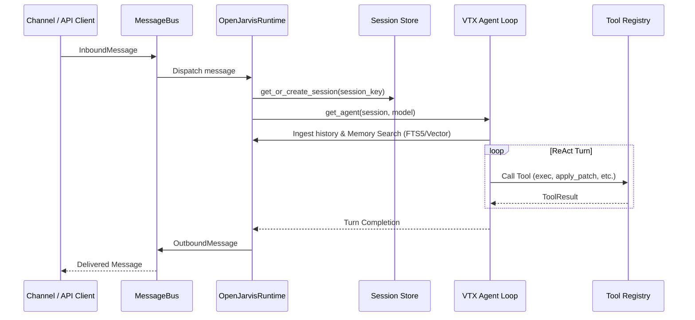

# Agent Runtime & Memory

This guide explores the OpenJarvis agent loop, execution lifecycle, memory indexing systems, and hook extensions.

---

## 🔄 Agent Execution Lifecycle

OpenJarvis couples a reactive event loop with the VTX ReAct harness:



---

## 🧠 Memory Subsystems (`OpenJarvisMemory`)

OpenJarvis provides a multi-tier memory architecture to sustain long-term conversational intelligence:

### 1. SQLite FTS5 Full-Text Search
Stored locally at `~/.vtx/openjarvis/fts5.db`:
- Indexes turn queries, responses, and session metadata.
- Enables sub-millisecond retrieval with BM25 ranking.
- Allows agents to recall exact commands, code snippets, or user preferences discussed in past sessions.

### 2. Vector Embeddings
- Performs semantic retrieval across workspace documentation, past sessions, and reference files.
- Automatically computes cosine similarities to retrieve context relevant to the active prompt.

### 3. Skills Engine (`vtx.openjarvis.agent.skills`)
- Discovers skills in `.agents/skills/`, `.vtx/skills/`, or global directories.
- Skills define system prompt augmentations and slash commands (when `register_cmd: true` is configured).
- Parsed on runtime start and injected on-demand into prompt context.

---

## 📝 System Prompt Construction (`prompts.py`)

OpenJarvis dynamically compiles system prompts using:
- **Core Identity & Persona**: Defines autonomous behavior, safety rules, and coding standards.
- **Workspace State**: Current working directory, git branch, repository status, and environment variables.
- **Active Tool Declarations**: Injected guidelines for active tools (`exec`, `apply_patch`, `cron`, etc.).
- **Memory & Skills Context**: Injected search results and discovered skill signatures.

```python
from vtx.openjarvis.agent.context import OpenJarvisContext
from vtx.openjarvis.agent.prompts import build_openjarvis_system_prompt

ctx = OpenJarvisContext.load(cwd="/path/to/project")
system_prompt = build_openjarvis_system_prompt(
    cwd=ctx.workspace,
    vtx_config=ctx.vtx,
    tools=active_tools
)
```

---

## 🪝 Hooks & Extensions (`hook.py`)

Hooks allow developers to intercept agent execution events:
- `on_session_start(session_id)`: Triggered when a new conversation begins.
- `on_turn_start(query)`: Pre-process user queries or inject custom reminders.
- `on_tool_call(tool_name, params)`: Audit, filter, or log tool calls before execution.
- `on_turn_end(response)`: Post-process output or trigger external webhooks.

