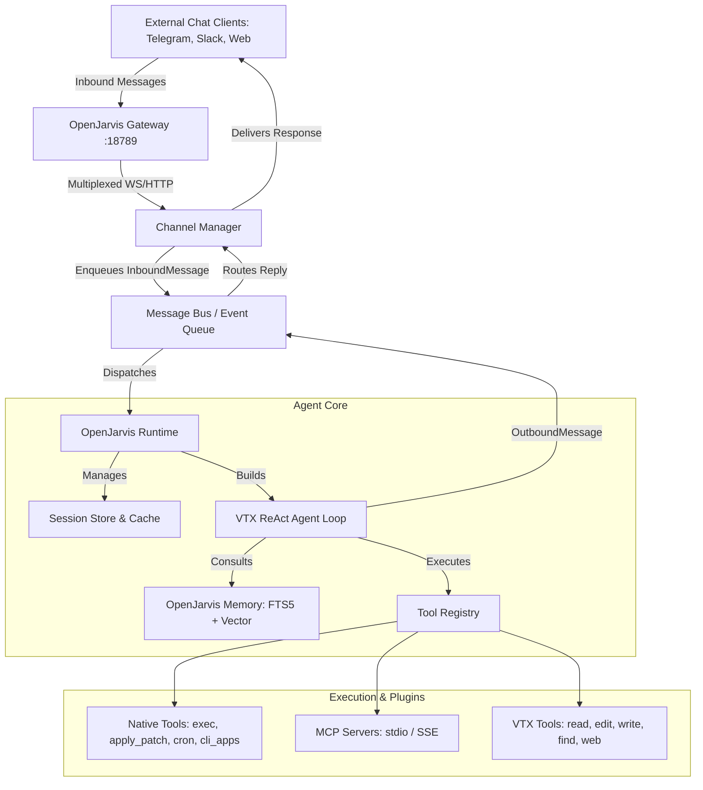

# OpenJarvis Architecture

This document details the architectural design and internal mechanisms of OpenJarvis.

---

## 🏗️ Layer Mapping

OpenJarvis operates as a unified service combining messaging adapters, event queues, execution runtimes, and the VTX Agent engine.

---

## 🧩 Core Subsystems

### 1. The Gateway (`vtx.openjarvis.server.gateway`)
The Gateway is a multiplexed single-port server (default port `18789`) serving both:
- **WebSocket Protocol (`/ws`)**: High-throughput duplex channel for desktop clients, mobile apps, and external orchestrators. Handles protocol frames (`connect`, `hello-ok`, `req/res`, and stream events).
- **HTTP REST API**:
  - `/health`: Health status endpoint.
  - `/v1/models`: OpenAI-compatible models listing.
  - `/v1/chat/completions`: OpenAI-compatible streaming and non-streaming chat completions proxying directly into OpenJarvis agent turns.

### 2. The Channel Manager (`vtx.openjarvis.channels.manager`)
- **Discovery**: Automatically scans channels via package discovery (`vtx.openjarvis.channels.*`) and dynamic entry points (`vtx.openjarvis.channels`).
- **Ingress / Egress Routing**: Converts platform-specific payloads into normalized `InboundMessage` objects and distributes `OutboundMessage` events with automatic retry backoff.
- **Session Scoping**: Generates isolated or shared session keys based on configuration:
  - `main`: Global shared session.
  - `per-peer`: Unique session per sender across all channels.
  - `per-channel-peer`: Channel-isolated sender session (e.g. `telegram:user123`).
  - `per-account-channel-peer`: Workspace and account isolated.

### 3. OpenJarvis Runtime (`vtx.openjarvis.agent.runtime`)
The single-process runtime coordinator that:
- Instantiates and caches `Session` instances and `VtxAgent` loops.
- Assembles curated tool registries combining VTX built-ins and OpenJarvis native tools.
- Binds `CronService` and `ChannelManager` event buses.
- Exposes clean interfaces for interactive CLI, headless daemon, and WebSocket consumers.

### 4. Event Bus (`vtx.openjarvis.bus`)
An asynchronous event bus facilitating decoupled communication across components:
- `InboundMessage`: Chat message ingress with sender metadata, text, attachments, and reply tracking.
- `OutboundMessage`: Outbound message replies with destination channel and recipient IDs.
- `ProgressUpdateEvent`: Real-time thinking and tool execution indicators.
- `RuntimeStateChanged`: Dynamic configuration and session state broadcast.

### 5. Multi-Layer Memory (`vtx.openjarvis.agent.memory`)
- **SQLite FTS5 Full-Text Search**: Persisted in `~/.vtx/openjarvis/fts5.db`, indexes past turns with BM25 ranking.
- **Vector Search Engine**: Semantic context retrieval matching user intent with past project context.
- **Skill Discovery**: Dynamically resolves modular skill instructions and slash commands.

### 6. Tool Discovery & Adapter Bridge (`vtx.openjarvis.tools`)
- Discovers `Tool` subclasses via `ToolLoader` and entry points.
- Bridges OpenJarvis JSON-schema-based tools to the VTX harness pydantic tool interface via `_OpenJarvisBaseToolAdapter`.
- Discards duplicate tools while preserving superior implementations (such as `exec` over basic `bash`).

