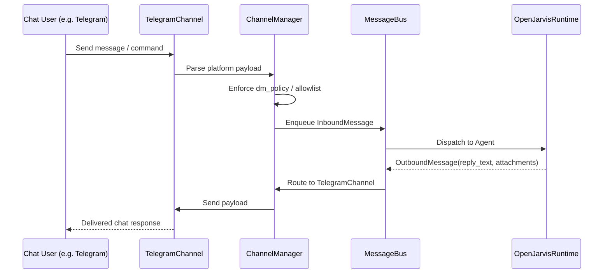

# Channels & Messaging Hub

OpenJarvis features a unified multi-channel messaging hub (`ChannelManager`) that connects the agent to over 15 communication platforms simultaneously.

---

## 📡 Supported Channels & Setup

All channel configurations live under the `"channels"` object in `~/.vtx/openjarvis.json`.

```json
{
  "channels": {
    "telegram": {
      "enabled": true,
      "dm_policy": "pairing",
      "extra": {
        "token": "123456:ABC-DEF1234ghIkl-zyx57W2v1u123ew11"
      }
    },
    "discord": {
      "enabled": true,
      "dm_policy": "allowlist",
      "allow_from": ["123456789012345678"],
      "extra": {
        "token": "DISCORD_BOT_TOKEN"
      }
    },
    "slack": {
      "enabled": true,
      "dm_policy": "open",
      "extra": {
        "bot_token": "xoxb-...",
        "app_token": "xapp-..."
      }
    }
  }
}
```

---

## 📋 Channel Matrix & Credentials

| Channel | Key Capabilities | Required Credentials (`extra` fields) |
| :--- | :--- | :--- |
| **Telegram** | Direct messages, groups, media, markdown, inline commands | `token` (from @BotFather) |
| **Discord** | Guild channels, threads, direct messages, attachments | `token` (from Discord Developer Portal) |
| **Slack** | Channels, DMs, thread replies, Socket Mode | `bot_token` (`xoxb-...`), `app_token` (`xapp-...`) |
| **WhatsApp** | Direct WhatsApp messaging via bridge | `api_key`, `phone_number_id`, `bridge_url` |
| **Signal** | Secure end-to-end encrypted messaging | `http_url` (signal-cli REST daemon), `account_number` |
| **Matrix** | Decentralized encrypted chat | `homeserver`, `user_id`, `access_token` |
| **Feishu (Lark)** | Enterprise chat, bot webhooks, rich card messages | `app_id`, `app_secret`, `verification_token` |
| **DingTalk** | Enterprise DingTalk bot & stream mode | `client_id`, `client_secret` |
| **WeCom / Weixin** | Enterprise WeChat bot integration | `corpid`, `corpsecret`, `agent_id` |
| **NapCat / QQ / MoChat** | OneBot v11 protocol & QQ messaging | `ws_url`, `access_token` |
| **Email** | Bidirectional email support (IMAP/SMTP) | `smtp_host`, `smtp_port`, `imap_host`, `username`, `password` |
| **Microsoft Teams** | MS Teams Bot Framework | `app_id`, `app_password`, `tenant_id` |
| **WebSocket** | High-speed JSON-RPC stream for custom clients | `port`, `auth_token` |

---

## 🔒 Security Policies & Access Control

Each channel account supports granular access policies:

### DM Policy (`dm_policy`)
Controls how direct messages are authorized:
- `"pairing"` *(Recommended)*: Unknown users receive a 6-digit pairing code. They cannot interact with the agent until you approve the pairing token via CLI (`vtx jarvis pairing`).
- `"allowlist"`: Only user IDs explicitly listed in `allow_from` can interact.
- `"open"`: Any user sending a DM can invoke the agent.
- `"disabled"`: Direct messages are ignored.

### Group Policy (`group_policy`)
Controls group/channel participation:
- `"allowlist"` *(Default)*: The agent only responds in group IDs listed in `group_allow_from`.
- `"open"`: Responds in any group where the bot is mentioned.
- `"disabled"`: Group messages are ignored.

---

## 🔄 Inbound & Outbound Event Flow



