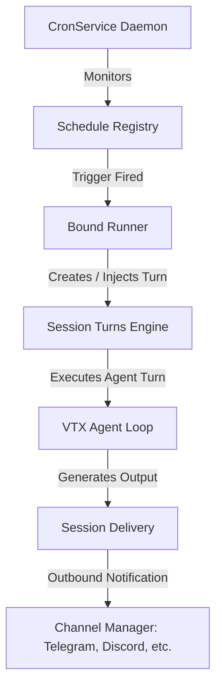

# Cron & Task Scheduling

OpenJarvis includes an asynchronous cron scheduler and long-running objective tracking system.

---

## ⏰ Cron Scheduler (`CronService`)

The `CronService` runs in the background of the OpenJarvis Gateway daemon, persisting jobs to `~/.vtx/openjarvis/cron.json`.



---

## 📅 Schedule Formats

1. **Standard 5-field Cron**:
   - `0 9 * * 1-5`: Monday to Friday at 09:00 AM.
   - `*/15 * * * *`: Every 15 minutes.
   - `0 0 1 * *`: First day of every month at midnight.
2. **ISO 8601 One-Time Timestamps**:
   - `2026-08-29T14:30:00Z`: Fire once at the specified time.

---

## 🎯 Long-Running Goals (`long_task` & `complete_goal`)

For multi-step projects requiring persistent attention across multiple sessions or agent restarts:

### 1. `long_task`
Attaches an objective to the active session:
```python
# Model calls long_task to set sustained focus
long_task(
    objective="Refactor database schema to PostgreSQL and migrate existing SQLite data",
    verification_steps=[
        "Draft migration scripts",
        "Run migration dry-run",
        "Verify all unit tests pass"
    ]
)
```

### 2. `complete_goal`
Marks the sustained goal completed once all verification steps succeed:
```python
complete_goal(
    summary="Successfully migrated SQLite database to PostgreSQL; verified with test suite."
)
```

